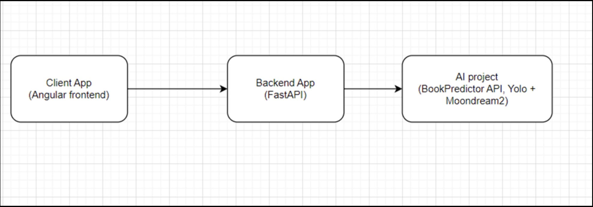
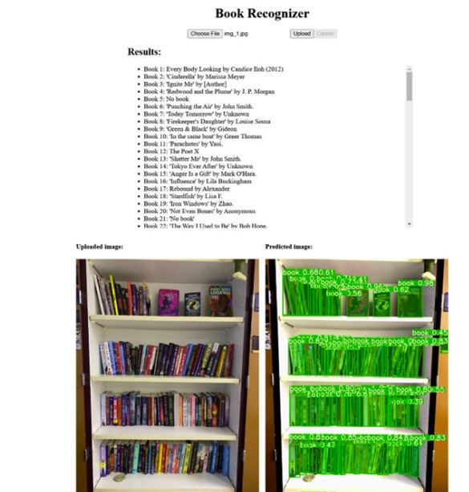

# Bookshelf Scanner App

## Introduction
Problem statement: Detect book titles and authors from bookshelf image  
Architecture components: AI, Backend and Frontend  
AI: Yolo v11 segmentation model, Moondream2 large language model, llama.cpp and quantization.  
Backend: FastAPI and streaming results  
Frontend: Angular  

## Book Recognition Workflow
Get image from the web application.  
Preprocess image: scale down resolution less than 2560, enhance the brightness and contrast.  
Reduce noise from the image using OpenCV fastNlMeansDenoisingColored.  
Segment image using YOLO 11x segmentation model.  
Mask all segmented books and crop them.  
Rotate to portrait orientation if segmented book is in spine position.  
Loop through cropped individual images and detect book title and author using Moondream2 model.  
Send results as available to client instead of sending all output at once.

## Architecture

## Function
Recognize book name, ISBN number automaticly, save human labor.

## Demo

## Challenges
Selecting the right OCR model, traditional OCR models and AI based OCR models.  
Traditional OCRs: EasyOCR, Tesseract, GOT-OCR2, TrOCR.  
AI based OCRs: Llama3.2-vision and Moondream2.  
Segmenting image using the YOLO or SAM model.  
Optimization, how to speed up inference time and increase accuracy.  
Hardware issues.

### Prerequisites
You need to have the following software installed to run the project:
- Node.js
- Python
- CUDA Toolkit
